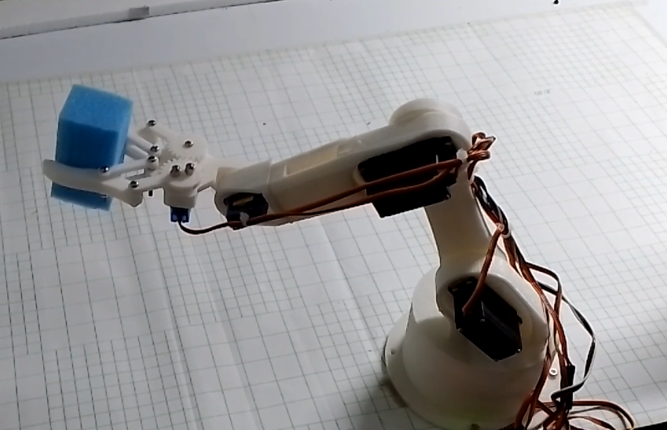

# Robot Arm Manipulator

**4 DoF Robot arm which is capable of performing pick and place tasks based on given coordinates.** 

- Forward kinematics and inverse kinematics were derived using the DH table. 

- When pick and place locations were given, 
    - Calculating joint angles using a derived closed-form solution of inverse kinematics and trajectory planning were done on the computer side with NumPy and SymPy 

    - Controlling servos was handled on the microcontroller side. 
    
- Serial communication was used to communicate with the microcontroller.

  

